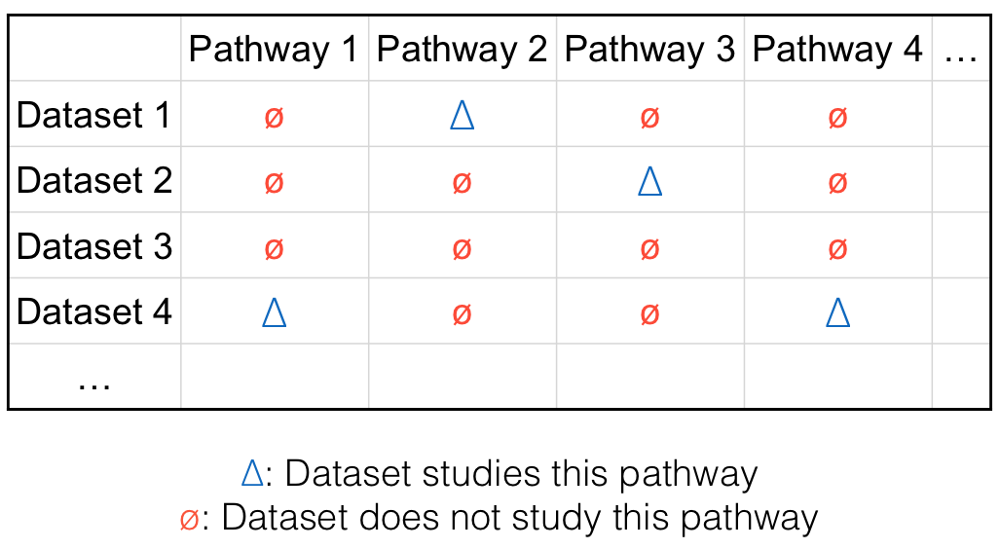
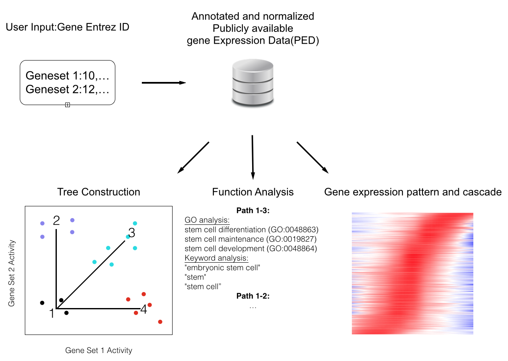
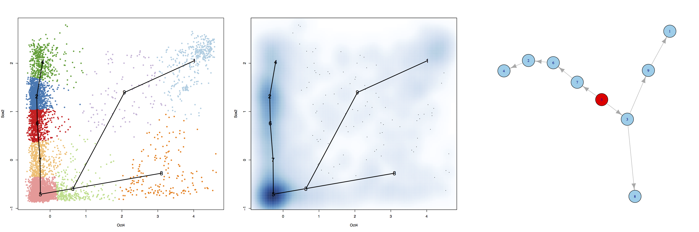
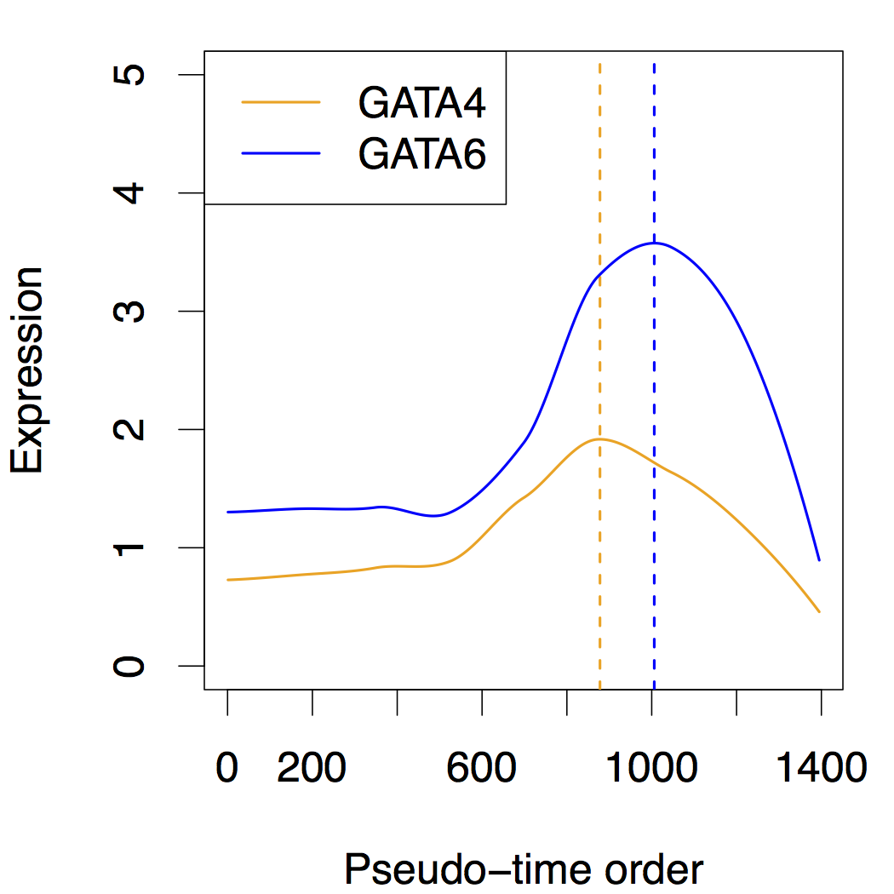
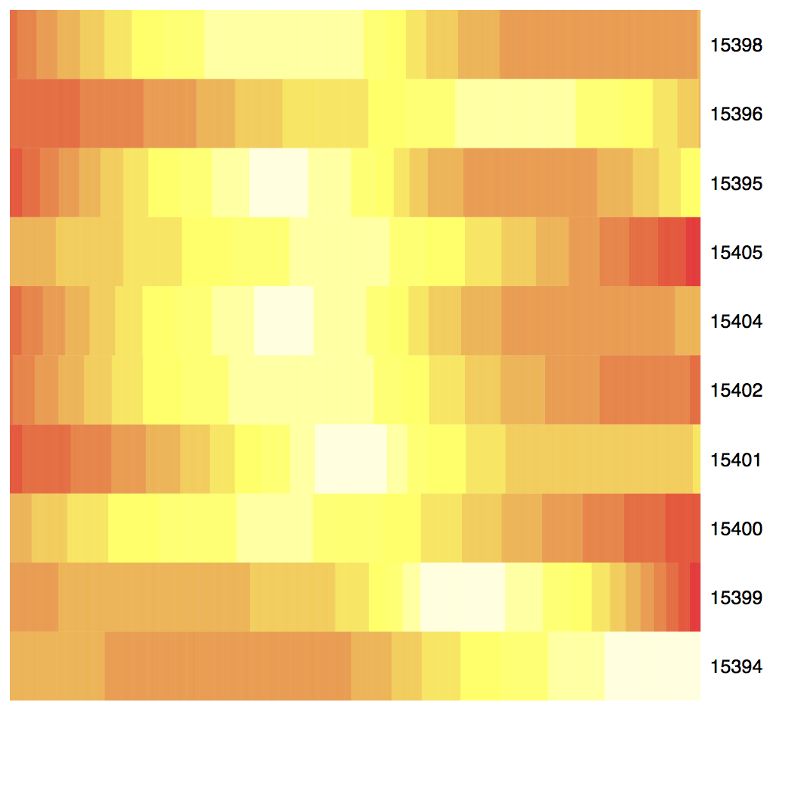
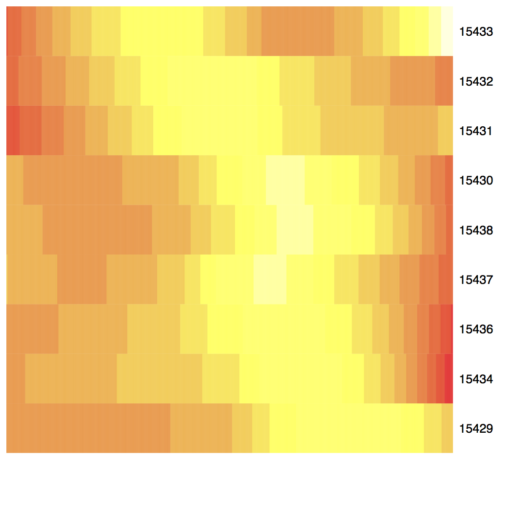
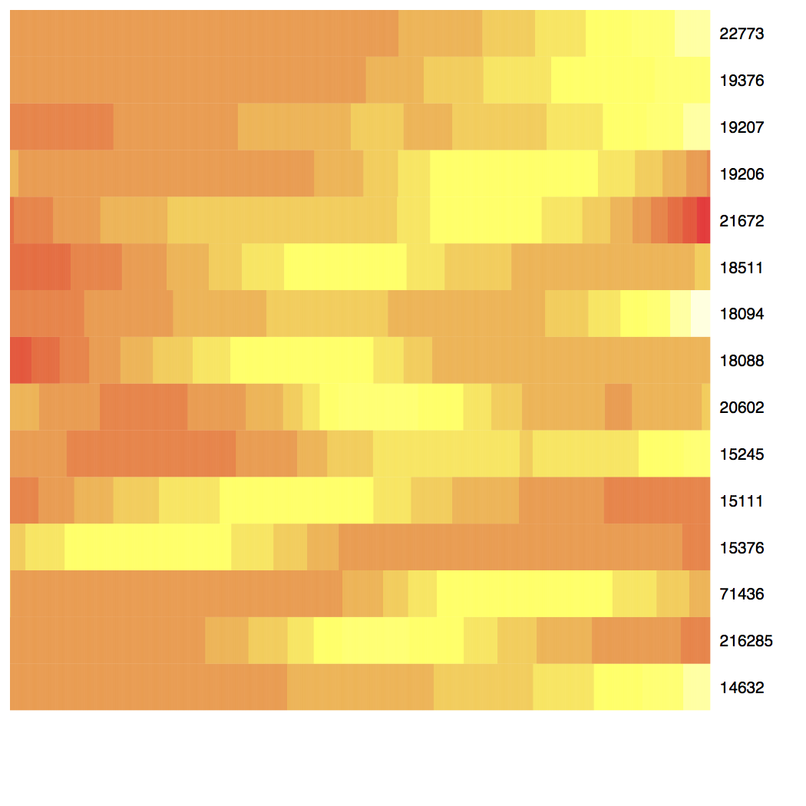
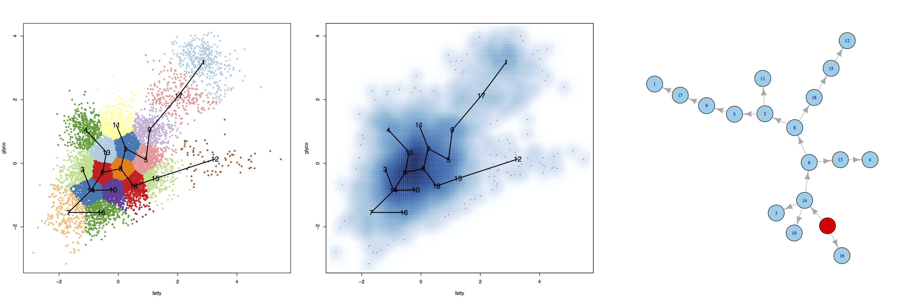
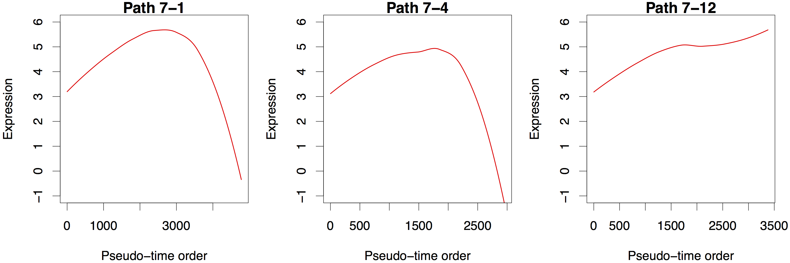

## GSPA Overview

 

* A noval computational method & open source software package to systematically explore PED.

* GSCA: supervised learning (users should give POI); GSPA: unsupervised learning (no POI is required).

* Explore functional roles of gene sets; Study gene expression pattern and cascade

---

## Background

* 200,000+ gene expression samples stored in public databases such as GEO and ArrayExpress.

* PED contain vast amount of information, but not fully utilized so far.

<!-- Microarray dataset 1 generated by one investigator for studying pathway 2 may also contain information about pathway 1. This information may not be used by the original investigator for his/her study of pathway 2, but it can be useful for other people who want to study pathway 1 --> 

---

## Challenges

 

* Reuse of PED enables one to systematically examine gene or pathway’s activities in a broad spectrum of biological contexts, saving resources of generating the data.

* Several roadblocks to be removed before PED can be reused:

      + Gene expression data should be constantly normalized and annotated.

      + Data should be easy to visualize and retrieve.

      + One needs efficient way to analyze the data and turn them into useful knowledge.

* None of these is trivial given the complexity, heterogeneity and size of the data.

---

## GSCA

---

## GSPA

---

## GSPA Method: Tree Construction

 

1. Cluster samples using k-means

2. Construct tree using "water-flow" algorithm to connect the cluster centers

3. Assign samples on the tree and form pseudo-time ordering

---

## GSPA Method: Downstream Analysis

 

1. Function analysis of paths: keyword and GO

2. Gene expression pattern and cascade

---

## Example I: Oct4 and Sox2

 

---

## Example I: Oct4 and Sox2

Path 5-3-9-1 (Oct4 and Sox2 both increase):

GO analysis:

stem cell differentiation (GO:0048863)

stem cell maintenance (GO:0019827)

embryo development (GO:0009790)

stem cell development (GO:0048864)

single-organism developmental process (GO:0044767)

keyword:

embryonic stem cell; stem; stem cell; liver; blastocyst; fat

---

## Example I: Oct4 and Sox2

Path 5-7-6-2-4 (Oct4 low and Sox2 increases):

GO analysis:

nervous system development (GO:0007399)

neurogenesis (GO:0022008)

generation of neurons (GO:0048699)

anatomical structure development (GO:0048856)

cellular developmental process (GO:0048869)

keyword:

brain; lung; cortex; liver; capillary; hippocampus

---

## Example I: Oct4 and Sox2

Path 5-3-8 (Oct4 increases and Sox2 low):

GO analysis:

cell cycle (GO:0007049)

cell cycle process (GO:0022402)

mitotic nuclear division (GO:0007067)

mitotic cell cycle process (GO:1903047)

nuclear division (GO:0000280)

keyword:

embryo; testis; liver; retrovirus; oocyte; ageing

---

## Example I: Oct4 and Sox2

---

## Example I: Oct4 and Sox2

Hoxa family genes:

---

## Example I: Oct4 and Sox2

Hoxd family genes:

---

## Example I: Oct4 and Sox2

Gli1 and binding genes:

---

## Example II: Fatty acid and Glycolysis

 

---

## Example II: Fatty acid and Glycolysis

Path 7-1 (fatty acid and glycolysis both increase):

GO analysis:

muscle system process (GO:0003012)

muscle contraction (GO:0006936)

actin-myosin filament sliding (GO:0033275)

muscle filament sliding (GO:0030049)

actin-mediated cell contraction (GO:0070252)

keyword:

muscle; skeletal muscle; blood; biopsy; placenta; blood cell

---

## Example II: Fatty acid and Glycolysis

Path 7-4 (fatty acid low and glycolysis increases):

GO analysis:

synaptic transmission (GO:0007268)

cell-cell signaling (GO:0007267)

neurotransmitter transport (GO:0006836)

single-organism transport (GO:0044765)

transport (GO:0006810)

keyword:

cortex; blood; brain; cerebellum; blood cell; placenta

---

## Example II: Fatty acid and Glycolysis

Path 7-12 (glycolysis low and fatty acid increases):

GO analysis:

oxidation-reduction process (GO:0055114)

carboxylic acid metabolic process (GO:0019752)

small molecule metabolic process (GO:0044281)

oxoacid metabolic process (GO:0043436)

organic acid metabolic process (GO:0006082)

keyword:

placenta; cancer; blood pressure; breathing; carbon; carbon dioxide

---

## Example II: Fatty acid and Glycolysis

---

## Data Packages

 

* Affymetrix Human Genome U133a Array (GPL96) : 11778 human samples on 12495 genes

* Affymetrix Mouse Genome 430 2.0 Array (GPL1261) : 9444 mouse samples on 20630 genes

* Affymetrix Human Genome U133 Plus 2.0 Array (GPL570) : 5153 human samples on 19944 genes

* Affymetrix Human Genome U133A 2.0 Array (GPL571) : 313 human samples on 12494 genes

---

## Availability

 

GSPA package is still under development will soon be available on Github and Bioconductor.

--- .segue .dark

Thank you!
-----

